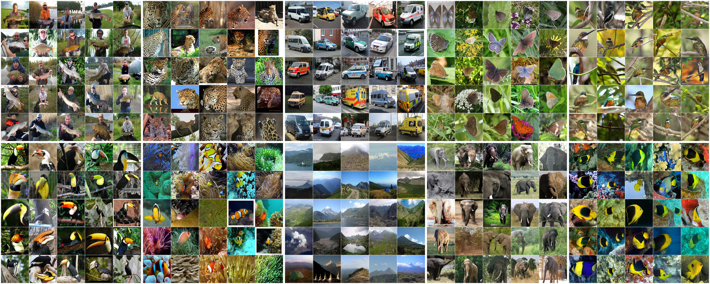

# Making similar distributed Training DB with Target DB

## Reference
> github : https://github.com/wvangansbeke/Unsupervised-Classification
> paper : [**SCAN: Learning to Classify Images without Labels**](https://arxiv.org/pdf/2005.12320.pdf)
> slides : https://wvangansbeke.github.io/pdfs/unsupervised_classification.pdf

<p align="center">
    
<p align="center">
    


## Contents
1. [Introduction](#introduction)
0. [Prior Work](#prior-work)
0. [Installation](#installation)
0. [Training](#training)

## Introduction
Can we automatically group images into semantically meaningful clusters when ground-truth annotations are absent? The task of unsupervised image classification remains an important, and open challenge in computer vision. Several recent approaches have tried to tackle this problem in an end-to-end fashion. In this paper, we deviate from recent works, and advocate a two-step approach where feature learning and clustering are decoupled.

We outperform state-of-the-art methods by large margins, in particular +26.6% on CIFAR10, +25.0% on CIFAR100-20 and +21.3% on STL10 in terms of classification accuracy.  Our method is the first to perform well on ImageNet (1000 classes).
__Check out the benchmarks on the [Papers-with-code](https://paperswithcode.com/paper/learning-to-classify-images-without-labels) website for [Image Clustering](https://paperswithcode.com/task/image-clustering) and [Unsupervised Image Classification](https://paperswithcode.com/task/unsupervised-image-classification).__

## Prior Work
- Train set/test set:
We would like to point out that most prior work in unsupervised classification use both the train and test set during training. We believe this is bad practice and therefore propose to only train on the train set. The final numbers should be reported on the test set (see table 3 of our paper). This also allows us to directly compare with supervised and semi-supervised methods in the literature. We encourage future work to do the same. We observe around 2% improvement over the reported numbers when including the test set.

- Reproducibility: 
We noticed that prior work is very initialization sensitive. So, we don't think reporting a single number is therefore fair. We report our results as the mean and standard deviation over 10 runs. 

Please follow the instructions underneath to perform semantic clustering with SCAN.

## Installation
The code runs with recent Pytorch versions, e.g. 1.4. 
Assuming [Anaconda](https://docs.anaconda.com/anaconda/install/), the most important packages can be installed as:

### In Docker
download Anaconda [link](https://www.anaconda.com/products/individual#linux)
```shell 
#set Anaconda path 
bash ${Anaconda_install_file}
vim ~/.bashrc
add PATH:
    export PATH="${Anaconda_dir}/bin:$PATH"
source ~/.bashrc
```

```shell
#Install packages
conda install pytorch=1.4.0 torchvision=0.5.0 cudatoolkit=10.0 -c pytorch
conda install matplotlib scipy scikit-learn   # For evaluation and confusion matrix visualization
conda install -c conda-forge faiss-gpu        # For efficient nearest neighbors search 
conda install pyyaml                          # For using config files
conda install -c conda-forge easydict
conda install termcolor                       # For colored print statements
```
We refer to the `requirements.txt` file for an overview of the packages in the environment we used to produce our results.

## Training

### Setup
The following files need to be adapted in order to run the code on your own machine:
- Change the file paths to the datasets in `utils/mypath.py`, e.g. `/path/to/cifar10`.
- Specify the output directory in `configs/env.yml`. All results will be stored under this directory. 

Our experimental evaluation includes the following datasets: CIFAR10, CIFAR100-20, STL10 and ImageNet. The ImageNet dataset should be downloaded separately and saved to the path described in `utils/mypath.py`. Other datasets will be downloaded automatically and saved to the correct path when missing.

### Train model
The configuration files can be found in the `configs/` directory. The training procedure consists of the following steps:
- __STEP 1__: Solve the pretext task i.e. `simclr.py`
- __STEP 1-1__: Extract the features of Train DB & Target DB. `feateure_extract.py`
- __STEP 1-2__: Get Nearest Neighbor and Sampling the similar distributed (new) Train DB. `nn_maker.py`
- __STEP 2 (not yet)__: Perform the clustering step i.e. `scan.py`
- __STEP 3 (not yet)__: Perform the self-labeling step i.e. `selflabel.py`

For example, run the following commands sequentially to perform our method on svkpi_v2:
```shell
#STEP 1
python simclr.py --config_env configs/your_env.yml --config_exp configs/pretext/simclr_svkpi_v2.yml

#STEP 1-1
python feature_extract.py python feature_extract.py --config_env ./configs/your_env.yml --config_exp ./configs/pretext/simclr_svkpi_v2.yml --gpus ${GPU_ID} --pretext_model ${trained pretext model} --save_feature_name ${save_feature_name}

#STEP 1-2
python nn_maker.py --target_csv ${target_feature} --near_csv ${near_feature} --save_dir ${save_dir} --target_db ${target_DB} --near_db ${near_DB} --nn_factor ${nn_top_K} --dist_thr ${cosine_distance_threshold}

#STEP 2
python scan.py --config_env configs/your_env.yml --config_exp configs/scan/scan_svkpi_v2.yml --gpus ${GPU_ID}

#STEP 3
python selflabel.py --config_env configs/your_env.yml --config_exp configs/selflabel/selflabel_cifar10.yml
```
### Remarks
The provided hyperparameters are identical for CIFAR10, CIFAR100-20 and STL10. However, fine-tuning the hyperparameters can further improve the results. We list the most important hyperparameters of our method below:
- Entropy weight: Can be adapted when the number of clusters changes. In general, try to avoid imbalanced clusters during training. 
- Confidence threshold: When every cluster contains a sufficiently large amount of confident samples, it can be beneficial to increase the threshold. This generally helps to decrease the noise. The ablation can be found in the paper. 
- Number of neighbors in SCAN: The dependency on this hyperparameter is rather small as shown in the paper. 


## Tutorial

If you want to see another (more detailed) example for STL-10, checkout [TUTORIAL.md](https://github.com/wvangansbeke/Unsupervised-Classification/blob/master/TUTORIAL.md). It provides a detailed guide and includes visualizations and log files with the training progress.

## Citation

If you find this repo useful for your research, please consider citing our paper:

```bibtex
@inproceedings{vangansbeke2020scan,
  title={Scan: Learning to classify images without labels},
  author={Van Gansbeke, Wouter and Vandenhende, Simon and Georgoulis, Stamatios and Proesmans, Marc and Van Gool, Luc},
  booktitle={Proceedings of the European Conference on Computer Vision},
  year={2020}
}

```
